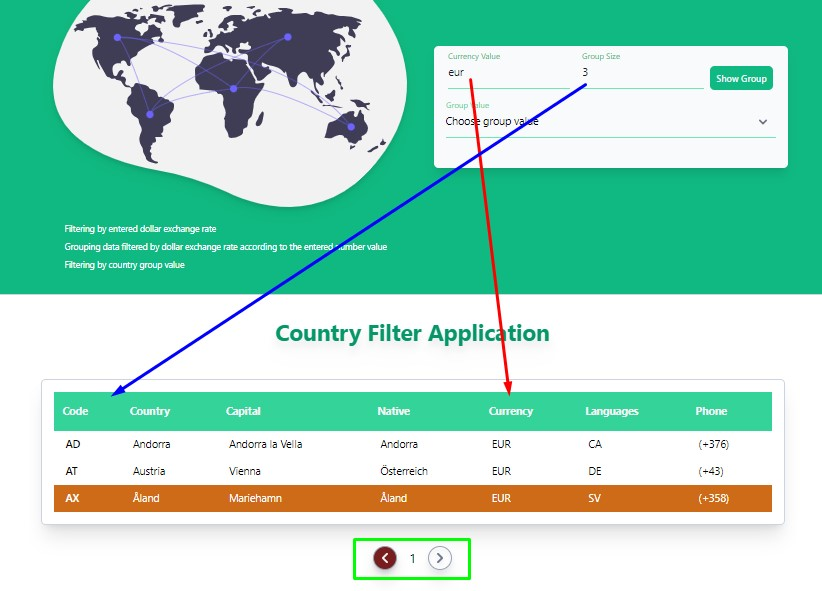

## Ülke Filtreleme Uygulaması - [Live Demo](https://country-filter-application.vercel.app/)

Projeyi oluştururken javascript'in **React** framework'unu kullandım. Proje tasarımını **Tailwindcss** kullanarak yaptım. Graphql üzerindende appolo kütüphanesini kullanarak verileri kendi localime çektim.

Projede state yönetimini React Context yapısı ile yaptım. Context içinde tanımladığım değişken ve fonksiyonları farklı bileşenler (components) içinde kullandım.

Bu projede girilen para birimine ve seçilen değere göre bir filteleme ve gruplama işlemi yapılıyor.

Sayfa ilk yüklendiğinde veriler gelirken bize bir yükleme(loading) animasyonu gösteriliyor. Veriler yüklendikten sonra animasyon kalkıyor ve yüklenen veriler bize bir tabloda sunuluyor. Gelen bu tablo üzerinden filtreleme ve gruplama işlemleri yapabiliyoruz.

Filtreleme işlemleri yapmak içinde 3 farklı input alanı oluşturdum. Bu input alanına girilen verilere göre bir filtreleme işlemi yapılacak.

Sayfa ilk yüklendiğinde bize 10. eleman seçilmiş olarak gelecek ve arka plan rengi diğer elemanlardan farklı olacaktır. Biz herhangi bir elemana seçtiğimizde seçtiğimiz elemanın arka plan rengi otamatik olarak değişecektir. Sadece bir tane eleman seçebiliyoruz. Birden fazla eleman seçemiyoruz.

Para birimine (Currency Value) göre filtreleme işlemi yaptığımızda filtrelenmiş olan verinin en son elemanı seçilmiş ve arka plan rengi değişmiş olarak gelecek.

- **1. Birinci input(Currency Value):** Bu inputa bize herhangi bir ülkenin para birimini girdiğimizde bize para birimine göre filtrelenmiş veriler gelecek. Eğer filtrelenmiş herhangi bir veri yok ise biz hata mesajı gösterilecek.

|  |  |
| -------------------------- | -------------------------- |

- **2. İkinci input(Group Size):** Bu input içine de verileri kaçlı olarak gruplamak istiyorsak ona göre bir gruplama işlemi yapacak. Örneğin **eur** para birimine göre bir filtreleme işlemi yaptığımızda ve bize 35 tane veri geldiğini varsayalım. Biz bu 35 veriyi üçerli gruplar halinde gruplamak istersek groupSize inputu içine 3 değerini girmemiz yeterli. Girilen 3 değeri sonucunda biz toplam 12 tane üçerli bir gruplama işlemi yapacak ve biz gruplar arasında ileri geri tuşları ile dolaşabileceğiz.
  Listeye Dön (return list) butonuna tıkladığımzda bize bütün listeyi geri getirecek.

|  |  |  |
| -------------------------- | -------------------------- | -------------------------- |

- **3. Secenek Alanı(Select Value):** Bu alanda ise bize verilen secenekler arasından seçtiğimiz değer durumuna göre bize filtreleme gruplama işelemi yapılacak.Filtrelenen değerleri bize alt gruplanmış şekilde gösterilecek.

|  |  |
| -------------------------- | -------------------------- |

- Yukarıdaki resimlerde mavi dikdörtgen içinde belirtilen `return list` butonuna tıkladığımız da bizi bütün verilerin olduğu tabloya yönlendirecek.

#### Api Kaynaklı Hata Mesajı

|  |
| -------------------------- |

Veri çekme işlemi sırasında api'den kaynaklı bir hata meydana geldiğinde bize hata mesaj erkanda gösterilecek.

### Developer

- Developer - [Musa Sayar]

### İletişim

